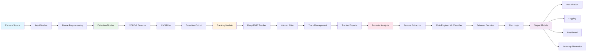

# System Architecture Design

## Overview

The Real-Time Intelligent Surveillance System is a modular, pipeline-based architecture designed for detecting, tracking, and analyzing human behavior in video streams. The system prioritizes real-time performance, extensibility, and clear separation of concerns.

---

## High-Level Architecture



---

## Architectural Patterns

### 1. Pipeline Pattern
The system follows a linear processing pipeline where data flows sequentially through modules. Each module has a single responsibility and well-defined interfaces.

### 2. Producer-Consumer Pattern
Frame capture runs independently from processing, using a queue-based buffer to handle temporary speed mismatches.

### 3. Strategy Pattern
Behavior analysis supports pluggable implementations: rule-based engine or ML-based classifier.

### 4. Observer Pattern
The output module observes events from all upstream modules (detections, tracks, behaviors) and dispatches to multiple consumers (display, logger, alerter).

---

## Component Responsibilities

| Module | Responsibility | Key Technology |
|--------|---------------|----------------|
| Input | Video acquisition and preprocessing | OpenCV |
| Detection | Human detection in frames | YOLOv8 |
| Tracking | Maintain identity across frames | DeepSORT |
| Behavior Analysis | Classify movement patterns | Rule Engine + Optional ML |
| Output | Visualization, alerts, logging | Streamlit, OpenCV |

---

## Data Interfaces

### Module Interfaces

```
InputModule → DetectionModule
    Output: Frame (ndarray), Timestamp (float), Metadata (dict)

DetectionModule → TrackingModule
    Output: List[Detection] = [(bbox, confidence, class_id)]

TrackingModule → BehaviorAnalysisModule
    Output: List[Track] = [(track_id, bbox, history, state)]

BehaviorAnalysisModule → OutputModule
    Output: List[BehaviorEvent] = [(track_id, behavior, confidence, alert_flag)]
```

---

## Scalability Considerations

### Horizontal Scaling
- Multiple camera sources can be processed by separate pipeline instances
- Each pipeline is state-independent

### Performance Optimization
- Frame skipping reduces detection frequency
- Resolution scaling for inference
- GPU acceleration for YOLO inference
- Thread isolation for I/O operations

---

## Extensibility Points

1. **New Input Sources**: RTSP, IP cameras, video files implement same interface
2. **Custom Detectors**: Replace YOLOv8 with other detectors maintaining same output format
3. **Alternative Trackers**: Swap DeepSORT for ByteTrack or SORT
4. **Behavior Models**: Add new ML models or rule sets without changing pipeline
5. **Output Channels**: Add database logging, SMS alerts, or API webhooks

---

## System Constraints

- **Real-time requirement**: Target 15-25 FPS on reference hardware
- **Latency budget**: End-to-end latency < 200ms
- **Memory limit**: Track history buffer capped at 5 seconds per track
- **Alert cooldown**: Minimum 5 seconds between consecutive alerts for same track

---

## Version History

| Version | Date | Changes |
|---------|------|---------|
| 1.0 | Current | Initial architecture design |
